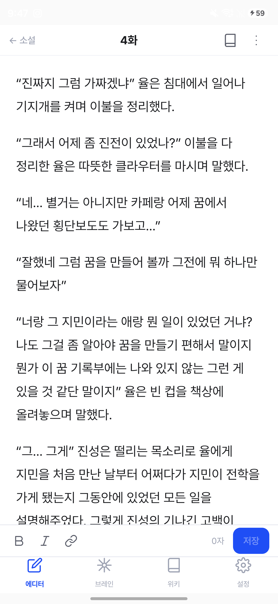
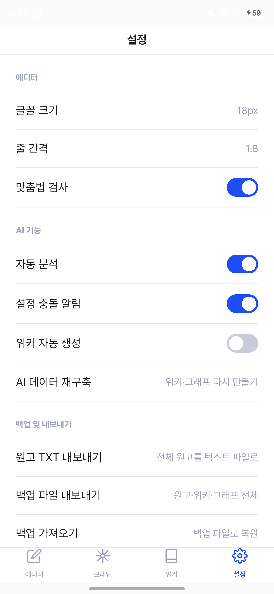
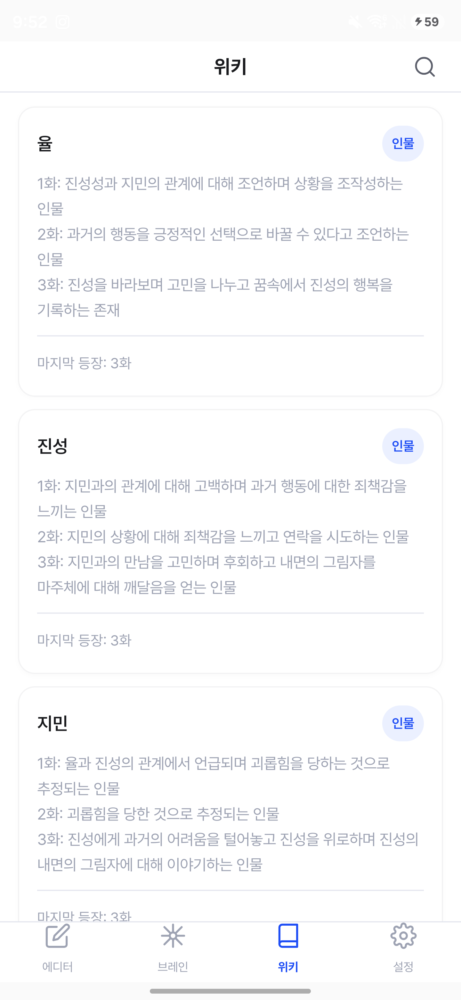

# StoryMind

소설을 쓰면 온디바이스 Gemma가 화(chapter)마다 등장인물·장소·사건 같은 엔티티와 그 관계를
추출해 위키와 관계 그래프로 누적해 주는 Android 집필 앱입니다. 아직 개발 중인 실험적
프로젝트입니다 — 인터페이스와 인제스트 파이프라인 모두 변경될 수 있습니다.

핵심 아이디어는 단순합니다: **원고는 그대로 두고, AI가 원고를 읽어 파생 정보만 쌓는다.**
저장한 원고 자체는 앱도 AI도 건드리지 않는 불변 소스이고, 위키/그래프는 언제든 원고에서
다시 만들 수 있는 캐시입니다. 모델은 기기 밖으로 아무것도 보내지 않습니다 — 추론은 전부
단말기 안에서 LiteRT-LM으로 실행됩니다.

## 주요 기능

- **에디터** — 화 단위로 원고를 쓰고 저장합니다. 저장은 즉시 완료되고, 인제스트(AI 분석)는
  백그라운드에서 비동기로 진행되어 실패해도 다음 화로 넘어가는 데 지장이 없습니다.
- **위키** — 원고에서 추출된 인물·장소·소품·사건 항목이 화별 이력과 함께 자동으로 쌓입니다.
- **브레인 그래프** — 엔티티 간 관계를 원형 그래프로 시각화하고, 어디와도 연결되지 않은
  고아 노드를 표시합니다.
- **설정 충돌 린트** — 위키 이력을 시간순으로 다시 살펴 앞뒤가 안 맞는 설정을 온디맨드로
  검사합니다.
- **AI 데이터 재구축** — 위키·그래프가 잘못 쌓였다 싶으면 지우고 원고 전체에서 처음부터
  다시 만듭니다. 원고 자체는 건드리지 않습니다.
- **백업 및 내보내기** — 전체 원고를 텍스트 파일로, DB 전체(원고+위키+그래프)를 백업 파일로
  내보내고, 백업 파일에서 검증을 거쳐 복원할 수 있습니다. 전부 adb 없이 기기 안에서
  가능합니다.

## 스크린샷

| 에디터 | 설정 (백업/내보내기 포함) | 위키 |
|---|---|---|
|  |  |  |

## 빌드 및 실행

### 요구사항

- Android Studio (또는 `gradlew`만으로도 커맨드라인 빌드 가능)
- 실기기 또는 에뮬레이터, **minSdk 31 이상**
- 온디바이스 추론이라 **GPU 가속 가능 기기를 권장**합니다 — 앱이 시작 시 GPU 백엔드로
  모델을 초기화하고, 실패하면 자동으로 CPU 백엔드로 폴백합니다(느리지만 동작은 합니다).
- 온디바이스 모델 파일(`gemma-4-E2B-it.litertlm`, 약 2.5GB) — 앱 저장소가 아니라
  기기의 `getExternalFilesDir("models")`에 있어야 인제스트/린트 기능이 동작합니다.

### 모델 파일 준비

```bash
scripts/push-model.sh      # macOS/Linux
scripts\push-model.bat     # Windows
```

기기가 `adb`로 연결되어 있으면, 스크립트가 모델을 로컬에 캐시해 두고(최초 1회만 다운로드,
이후엔 재사용) 기기의 올바른 경로로 푸시합니다. 모델 파일 없이도 앱 자체는 실행되지만,
인제스트/린트/재구축 등 AI 관련 기능은 비활성 상태로 표시됩니다.

### 빌드

```bash
./gradlew :app:assembleDebug     # 디버그 APK 빌드
./gradlew test                   # 단위 테스트 (JDK/에뮬레이터 불필요)
./gradlew connectedAndroidTest   # 계측 테스트 — 기기/에뮬레이터 + 모델 파일 필요
```

Windows에서는 `gradlew.bat`을 사용하세요.

## 아키텍처

`:core`(Kotlin Multiplatform, android+jvm 타깃)가 인제스트/린트 파이프라인 같은 순수
도메인 로직을 담당하고, `:app`(Android)이 Compose UI, Room 영속성, WorkManager 백그라운드
작업, 그리고 LiteRT-LM을 감싸는 유일한 Android 구현체(`OnDeviceEngine`)를 담당합니다. 자세한
계층 구조와 아키텍처 불변 규칙은 [CLAUDE.md](CLAUDE.md)에 정리되어 있습니다.
